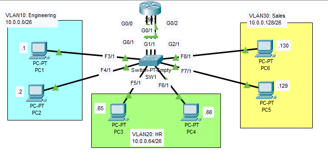

# VLAN Configuration Cisco Packet Tracer Lab

## Overview
This lab demonstrates VLAN segmentation in a network using **Cisco Packet Tracer**. We will configure three VLANs: **Engineering**, **HR**, and **Sales**. Each VLAN will be associated with its subnet, and communication across VLANs will be enabled using a router-on-a-stick configuration.

## Lab Objectives
1. **Configure the correct IP address and subnet mask** on each PC.
    - Set the gateway address as the **last usable address** of the subnet.
2. **Create three connections** between R1 and SW1.
    - Configure one interface on R1 for each VLAN.
    - Use the gateway IP addresses configured on the PCs.
3. **Assign VLANs to SW1's interfaces**:
    - Assign the appropriate VLANs to the interfaces that connect to the PCs.
    - Don't forget to configure the interfaces connecting R1 to SW1.
    - **Name the VLANs**: `Engineering`, `HR`, and `Sales`.
4. **Test connectivity**:
    - Ping between the PCs to ensure connectivity.
    - Send a **broadcast ping** from a PC (ping the subnet broadcast address) and observe which PCs receive the broadcast using **Packet Tracer's 'Simulation Mode'**.

## Network Diagram


## VLAN Configuration Details

| VLAN    | Subnet          | PCs           | Gateway           |
|---------|-----------------|---------------|-------------------|
| VLAN 10 | 10.0.0.0/26     | PC1, PC2      | 10.0.0.62         |
| VLAN 20 | 10.0.0.64/26    | PC3, PC4      | 10.0.0.126        |
| VLAN 30 | 10.0.0.128/26   | PC5, PC6      | 10.0.0.190        |

## Step-by-Step Instructions

### 1. PC Configuration
For each PC, assign the appropriate IP address, subnet mask, and gateway. For example:

- **PC1**:
  - IP Address: `10.0.0.1`
  - Subnet Mask: `255.255.255.192`
  - Gateway: `10.0.0.62`
  
- **PC3**:
  - IP Address: `10.0.0.65`
  - Subnet Mask: `255.255.255.192`
  - Gateway: `10.0.0.126`

Configure similar settings for the remaining PCs.

### 2. Router (R1) Configuration
Create sub-interfaces on the router for each VLAN and assign the corresponding IP address:

```bash
interface G0/0.10
 ip address 10.0.0.62 255.255.255.192

interface G0/0.20
 ip address 10.0.0.126 255.255.255.192

interface G0/0.30
 ip address 10.0.0.190 255.255.255.192
```
### 3. Switch (SW1) Configuration
Assign each port of the switch to the correct VLAN:
```bash
vlan 10
 name ENGINEERING

vlan 20
 name HR

vlan 30
 name SALES
 ```
Then, assign the interfaces to the correct VLANs:
```bash
interface FastEthernet0/1
 switchport mode access
 switchport access vlan 10

interface FastEthernet0/2
 switchport mode access
 switchport access vlan 10

interface FastEthernet0/5
 switchport mode access
 switchport access vlan 20

interface FastEthernet0/6
 switchport mode access
 switchport access vlan 20

interface FastEthernet0/3
 switchport mode access
 switchport access vlan 30

interface FastEthernet0/4
 switchport mode access
 switchport access vlan 30
```
### 4. Testing Connectivity
- Use the ping command on any PC to test connectivity with other PCs in the same VLAN and across VLANs.
- To test broadcast traffic, use Packet Tracer Simulation Mode:
   - From one PC, send a ping to the broadcast address of the VLAN (e.g., ping 10.0.0.63 for VLAN 10).
   - Observe which PCs receive the ping in the Simulation Mode.
## Conclusion
By completing this lab, I have successfully configured VLANs for **ENGINEERING**, **HR**, and **SALES**, ensuring that devices within each VLAN can communicate while routing between VLANs is facilitated by the router-on-a-stick configuration. I’ve also verified that broadcast traffic is isolated within VLANs, reducing unnecessary traffic across the network. This exercise has given me a deeper understanding of VLAN segmentation and its importance in network management and security.

## Acknowledgements


Special thanks to **Jeremy's IT Lab** for providing valuable resources and tutorials that greatly contributed to the completion of this exercise. His in-depth explanations and practical demonstrations have been instrumental in enhancing my understanding of Cisco networking concepts and the effective use of Packet Tracer.

For more information and additional resources, visit [Jeremy's IT Lab](https://jeremysitlab.com/) and check out his YouTube for the full course, [Jeremy's IT Lab Free CCNA 200-301 | Complete Course](https://www.youtube.com/playlist?list=PLxbwE86jKRgMpuZuLBivzlM8s2Dk5lXBQ)
